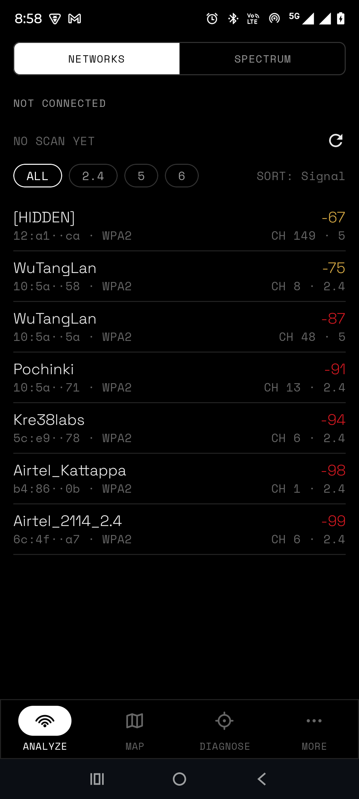
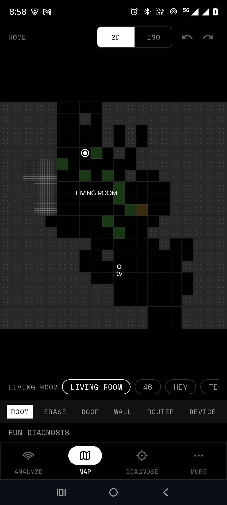
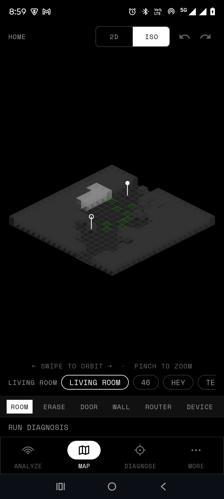
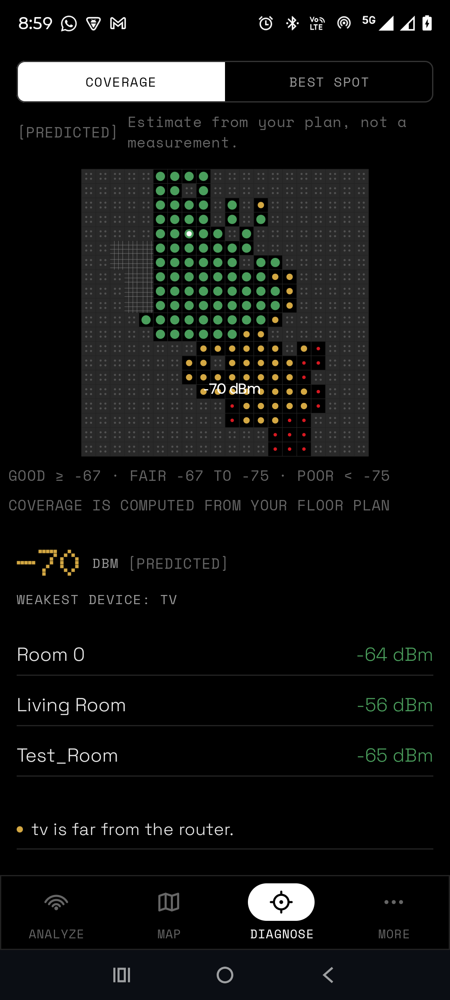
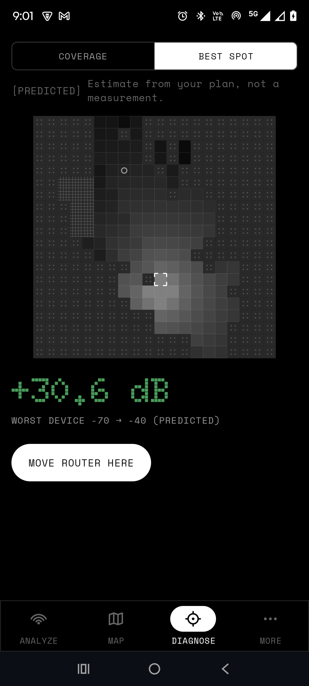
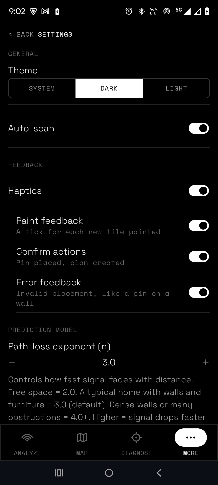

# WiFiLens

WiFiLens is an Android Wi-Fi analyzer that works offline and predicts coverage from a floor
plan you draw yourself, instead of making you walk around your home with a phone
taking measurements. Draw your rooms and walls, drop a pin where your router is and
pins where your devices are, and it simulates signal strength across every tile —
including telling you the single best spot to move the router to. No account, no
cloud, no ads. Everything runs on-device; the one exception is the optional **speed test** in
Diagnose, which uses the `INTERNET` permission to download test data from Cloudflare's speed-test
server when you tap *Run speed test* (Cloudflare sees your IP address, as with any web request).
Nothing about you or your floor plan is ever uploaded.

## Screenshots

| | | |
|---|---|---|
|  |  |  |
| Analyze — live scan of nearby networks, signal strength, channel and band | Map — the 2D floor plan editor: rooms, walls, doors, pins | Map — the same plan in an isometric view, orbit and zoom |
|  |  |  |
| Diagnose — predicted signal strength per tile, weakest device flagged | Diagnose — the optimizer's suggested router position and predicted gain | Settings — theme, haptics, and the prediction model's tunable constants |

## What it does

**Analyze** shows what's actually on the air around you right now: every nearby
network with its signal strength, channel, band and security, plus a spectrum view
that flags channel congestion and suggests a quieter one if you're on a crowded one.

**Map** is where you draw your home: a 2D grid editor for painting rooms, walls (each
tagged with a material — drywall, wood, glass, brick, concrete, metal), and doors, plus
an isometric view of the same plan you can orbit and zoom. Drop one pin for your router
and one for each device you care about.

**Diagnose** turns that floor plan into a prediction: a heatmap of signal strength
across every tile, a breakdown by room, plain-English findings ("kitchen is far from
the router"), and a Best Spot search that tries every walkable tile as a candidate
router position and tells you which one would help the most.

## How coverage prediction actually works

The floor plan is a grid of roughly 1-meter tiles, and every tile is exactly one of
three things: a **floor tile** belonging to a room, a **wall tile** carrying a
material, or a **door**. That's the entire model — a wall isn't a separate line or
shape layered on top of the grid, it's just a tile that isn't a floor tile.

The payoff of keeping it this simple is that the floor plan you draw, the coverage
heatmap you see, and the router-placement optimizer's search space are all *the same
grid*. There's no separate representation for "what I drew" versus "what gets
simulated" — nothing to export, convert, or keep in sync, because there's only one
data structure to begin with.

Signal strength at any tile is predicted with a standard log-distance path-loss model:

```
RSSI = A − 10·n·log₁₀(d) − Σ(wall losses)
```

- **A** — the reference signal strength at 1 meter from the router (dBm).
- **n** — the path-loss exponent: how fast signal fades with distance. Free space is
  around 2.0; a typical home with walls and furniture is around 3.0 (the default);
  dense walls or lots of obstructions push it toward 4.0 and beyond.
- **d** — the distance from the router to the tile, in meters.
- **wall losses** — the sum of the per-material attenuation of every wall the straight
  line from the router to that tile crosses, traced cell-by-cell with Bresenham's line
  algorithm — the same integer algorithm classically used for line rendering, here
  repurposed to enumerate exactly which grid cells a signal path passes through.

The Best Spot optimizer evaluates every walkable tile as a candidate router position,
scores each one by the *worst* predicted signal across every device pin you've placed
(a great signal in one room doesn't help if another device is starved), and returns
the tile that maximizes that worst case.

## Architecture

| Module | Purpose |
|---|---|
| `:app` | App shell — `MainActivity`, bottom navigation, the permission gate. |
| `:build-logic` | Gradle convention plugins, so every module's build config is one line. |
| `:core:rf` | The physics: path loss, wall loss, the Bresenham tracer, the grid model. |
| `:core:database` | Room entities/DAOs for the plan, rooms and pins; DataStore-backed settings. |
| `:core:designsystem` | A custom design system — tokens, typography, components. |
| `:core:wifi` | Wi-Fi scan and connection flows. |
| `:feature:analyze:presentation` | The Analyze tab. |
| `:feature:map` | The Map tab — 2D editor and isometric renderer. |
| `:feature:diagnose` | The Diagnose tab — coverage scoring and the optimizer. |
| `:feature:more` | Glossary, Settings, About. |

The one module worth calling out specifically is `:core:rf`. It's plain Kotlin/JVM —
zero Android imports, enforced at the compiler level by using the plain `kotlin.jvm`
Gradle plugin there instead of an Android library plugin, so an accidental Android
import simply won't compile. That's what makes the entire RF prediction engine
independently unit-testable in milliseconds, with no emulator and no Android runtime
in the loop, and it keeps a hard boundary between "the physics" and "the platform"
that the rest of the app can't accidentally blur.

See [DEVELOPMENT.md](DEVELOPMENT.md) for the full module breakdown, the hard
constraints the codebase is built around, and what's still on the roadmap.

## Tech stack

- Kotlin, Jetpack Compose
- MVI — `StateFlow` for state, sealed `Action`/`Event` types, a `Channel` for one-shot events
- Koin for dependency injection
- Room for the floor plan/rooms/pins, DataStore for settings
- Coroutines and Flow throughout, including `callbackFlow` for every listener-backed API
- Canvas-based custom rendering for the map editor and coverage view — no charting library
- R8 code and resource shrinking, shipped as an Android App Bundle

## Design system

WiFiLens uses a custom design system built from scratch rather than an off-the-shelf
UI kit — dark and light color tokens, a full typography scale, and a small set of
reusable components (chips, buttons, sheets, the bottom nav) that every screen is
built out of. The isometric map renderer and the coverage heatmap are both hand-built
on Canvas, not a third-party charting or 3D library.

## Running it

Requires Android Studio (or the Gradle wrapper directly) and JDK 17+. minSdk 26.

```
git clone <this repo>
./gradlew :app:assembleDebug
```

Open the project in Android Studio and run the `app` configuration on a device or
emulator running API 26+.

The RF physics engine has its own runnable test suite, worth running on its own since
it's real, meaningful coverage of the app's core prediction logic:

```
./gradlew :core:rf:test
```

## License

This project is licensed under the MIT License — see [LICENSE](LICENSE) for details.
