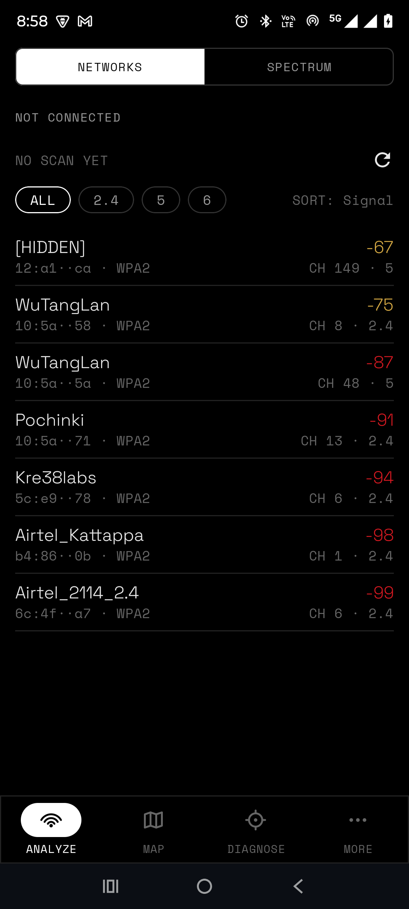
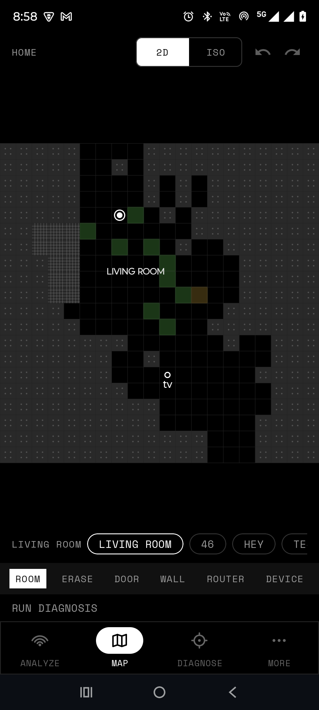
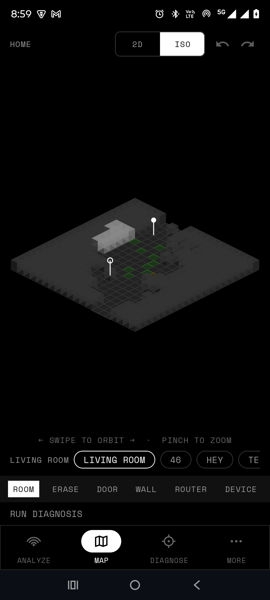
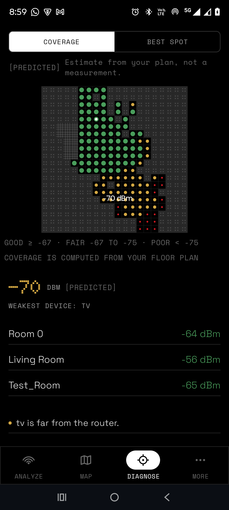
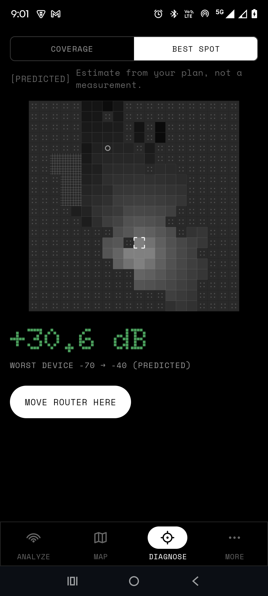

# WifiLens

WifiLens is an Android Wi-Fi analyzer that shows how your Wi-Fi reaches every room of your home. Draw a floor plan,
drop pins for your router and devices, and it predicts signal strength on every tile, lists the problem spots and
finds the best place to move the router. Walk around with the survey tool to measure real signal and calibrate the
prediction to your home.

No account, no ads, no analytics, no tracking. Scans, plans and history stay on the phone; the only internet use is
the optional speed test, which downloads test data from Cloudflare. See [PRIVACY.md](PRIVACY.md).

WifiLens 2.0 is the final release.

## Screenshots

| | | |
|---|---|---|
|  |  |  |
| Analyze: nearby networks, signal, band, channel, security | Health: one-tap check with fixes and a channel planner | Map: rooms, walls, doors, router and device pins |
|  |  |  |
| Map: the same plan in 3D, orbit and zoom | Diagnose: predicted coverage, weakest device, findings | Diagnose: where to move the router |

## What it does

**Analyze** shows what's on the air right now: every nearby network with its signal, band, channel and security, a
24-hour signal history per network, a spectrum view with congestion and the busiest hours, and a **Health** check
that grades your connection and says what to fix (crowded channel, a better band, a stronger access point, weak
security) plus the quietest channel on each band.

**Map** is where you draw your home: a 2D grid editor for rooms, walls tagged with a material (drywall, wood, glass,
brick, concrete, metal) and doors, and a 3D view you can orbit and zoom. Keep several plans and move them between
phones as JSON. The **walk survey** records the real signal where you stand and fits the prediction model to your
home.

**Diagnose** turns the plan into a prediction: signal on every tile, a breakdown by room, plain-language findings,
and a **Best spot** search over every walkable tile for the router position that helps the weakest device most. It
also has a speed test with history, a live signal meter, and a shareable PDF or image **coverage report**.

A **home-screen widget** and **Quick Settings tile** show your current signal at a glance.

## How coverage prediction works

The floor plan is a grid of roughly 1-meter tiles, and every tile is exactly one of three things: a **floor tile**
belonging to a room, a **wall tile** carrying a material, or a **door**. A wall isn't a line layered on top of the
grid; it's a tile that isn't floor. So the plan you draw, the heatmap you see and the optimizer's search space are
the same grid, with nothing to convert or keep in sync.

Signal strength at a tile uses the log-distance path-loss model:

```
RSSI = A − 10·n·log₁₀(d) − Σ(wall losses)
```

- **A**: the reference signal at 1 meter from the router (dBm).
- **n**: the path-loss exponent, how fast signal fades with distance. Free space is about 2.0; a typical home is
  about 3.0 (the default); dense walls push it toward 4.0.
- **d**: the distance from the router to the tile, in meters.
- **wall losses**: the attenuation of every wall the straight line from the router crosses, traced cell by cell
  with Bresenham's line algorithm.

A walk survey replaces the default **A** and **n** with values fitted to your own measurements (least squares), and
Diagnose shows its typical error.

The Best spot optimizer scores every walkable tile by the *worst* predicted signal across your device pins (a great
signal in one room doesn't help if another device is starved) and returns the tile that maximizes that worst case.

## Architecture

Clean layering with feature modules split into `domain`, `data` and `presentation` where a feature has its own
logic or storage, pure-Kotlin `:core:model` and `:core:rf`, and Hilt throughout. `:core:rf` uses the plain
`kotlin.jvm` plugin, so an Android import won't compile there, which keeps the RF engine unit-testable in
milliseconds. See [DEVELOPMENT.md](DEVELOPMENT.md) for the module table and constraints, and
[docs/adr](docs/adr/README.md) for the decisions behind them.

## Tech stack

- Kotlin, Jetpack Compose, Material 3 Expressive
- MVI: `StateFlow` for state, sealed actions, lifecycle-aware collection
- Hilt, including Hilt workers
- Room (versioned schemas and migrations) and DataStore
- Coroutines and Flow, with `callbackFlow` for every listener-backed API
- WorkManager, Jetpack Glance (widget), `TileService`
- Canvas rendering for the map editor, 3D view, heatmaps and charts, with no chart or 3D library
- Baseline Profile, macrobenchmarks, R8 full mode, shipped as an Android App Bundle

## Running it

Requires Android Studio (or the Gradle wrapper) and JDK 17+. minSdk 26, targetSdk 36.

```
git clone https://github.com/Wickedsoni/Wifilens.git
./gradlew :app:assembleDebug
./gradlew :core:rf:test
```

## License

MIT; see [LICENSE](LICENSE).
