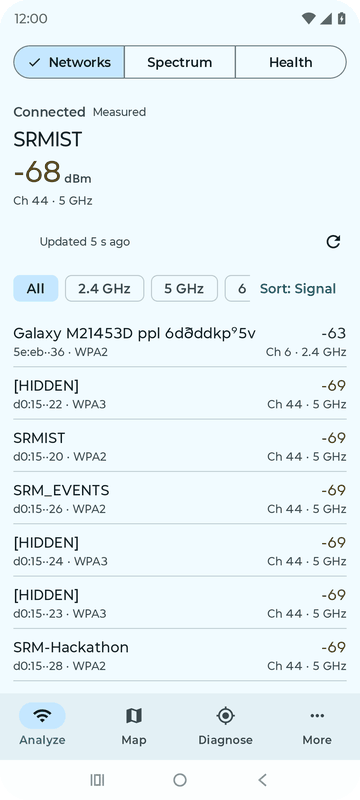
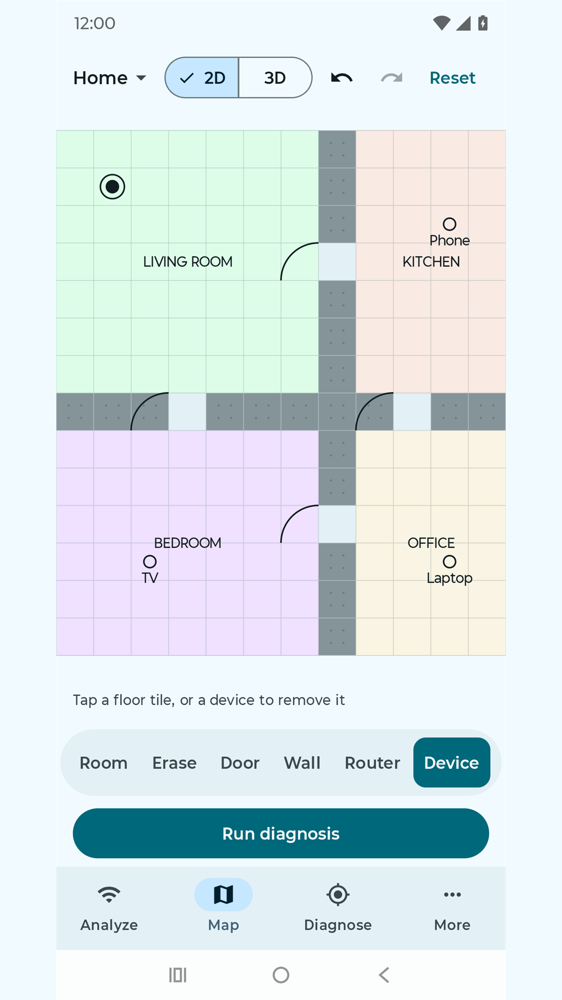
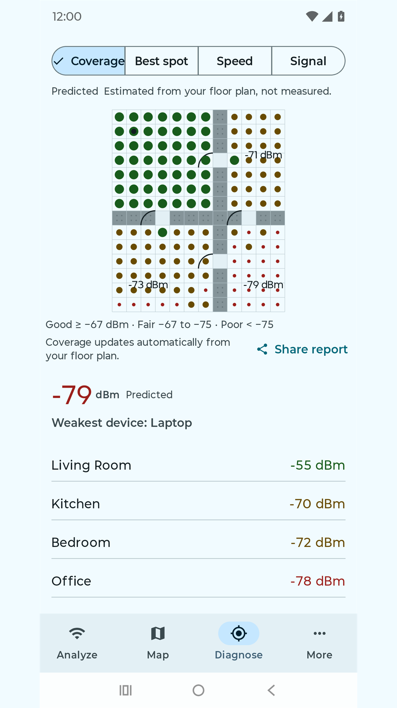
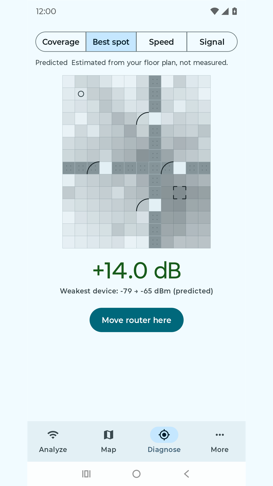
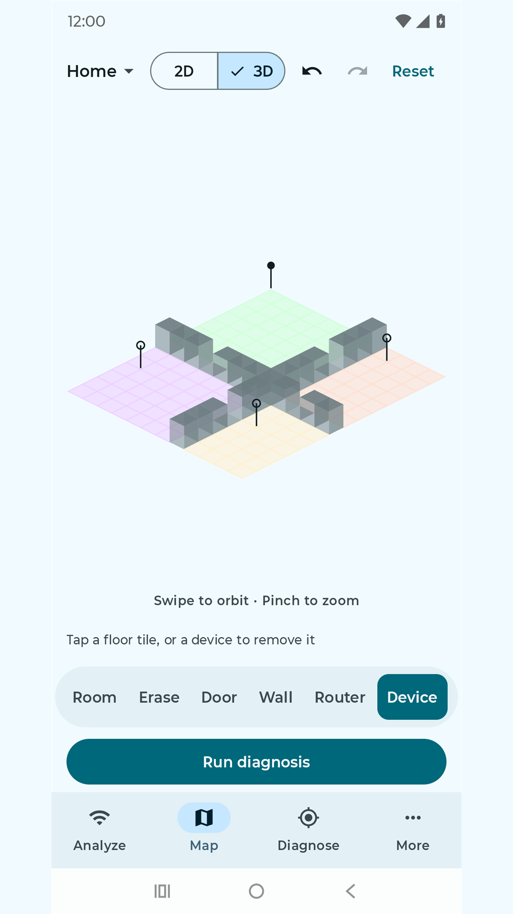
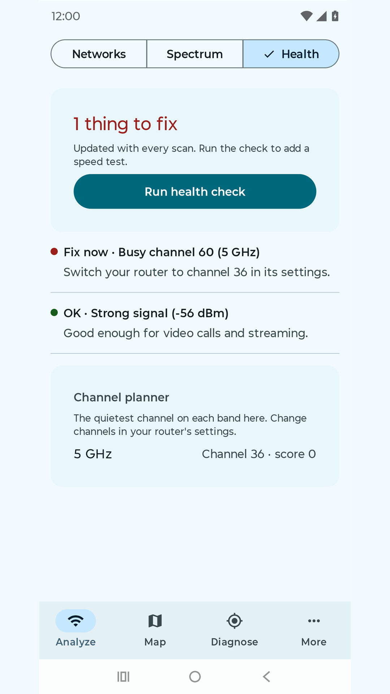
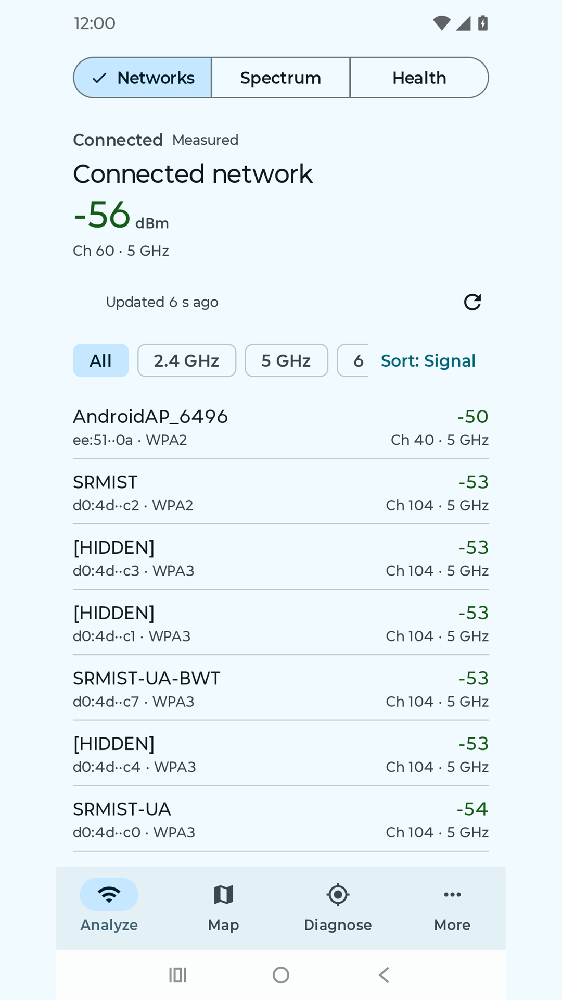
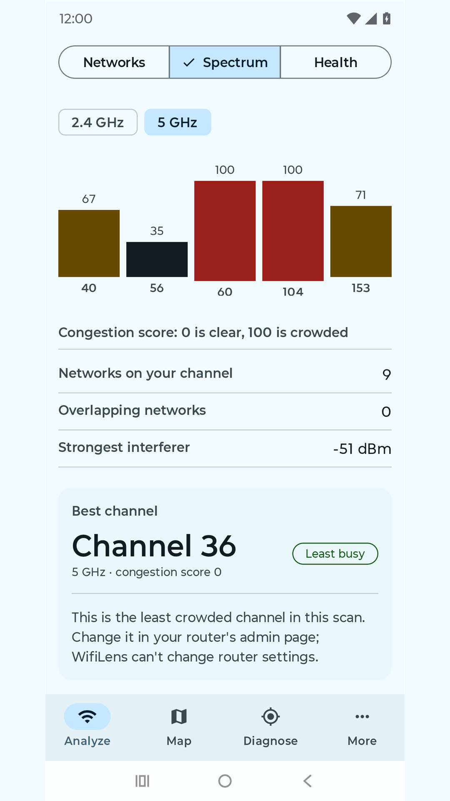
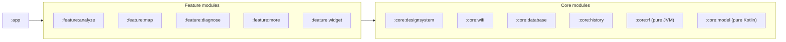

<p align="center">
  
</p>

<p align="center">
  <a href="https://github.com/Wickedsoni/Wifilens/actions/workflows/ci.yml"></a>
  
  
  
  <a href="LICENSE"></a>
  <a href="https://wifilens.garvitmaheshwari.in/privacy/"></a>
</p>

<p align="center">
  <b>An Android Wi-Fi analyzer that maps how your signal reaches every room.</b><br>
  Draw your floor plan, drop your router and devices, and WifiLens predicts the signal on every tile,<br>
  lists the dead spots and finds the best place to move the router.
</p>

<p align="center">
  <a href="https://wifilens.garvitmaheshwari.in">Website</a> ·
  <a href="docs/USER_GUIDE.md">User guide</a> ·
  <a href="docs/ARCHITECTURE.md">Architecture</a> ·
  <a href="CHANGELOG.md">Changelog</a> ·
  <a href="CONTRIBUTING.md">Contributing</a>
</p>

---

<table>
<tr>
<td width="38%" align="center"></td>
<td>

### What it does

📡 **Analyze** everything on the air: every nearby network with signal, band, channel and security, a spectrum view of
crowded channels, and a one-tap **Health** check that says what to fix in plain language.

🏠 **Map** your home on a simple grid: rooms, walls of different materials and doors, then see it in 3D. A
**walk survey** records the real signal where you stand and calibrates the prediction to your home.

🎯 **Diagnose** the result: predicted coverage for every room, the weakest device, and a **Best spot** search that
finds where the router helps your weakest device most. Plus a speed test, a live signal meter and a shareable
PDF or image report.

📱 **At a glance** with a home-screen widget and a Quick Settings tile.

🔒 **Private by design.** No account, no ads, no analytics. Plans, scans and history stay on the phone; the only
network use is the optional speed test. See the [privacy policy](https://wifilens.garvitmaheshwari.in/privacy/).

</td>
</tr>
</table>

## Screenshots

| Floor plan | Coverage | Best spot | 3D view |
|:---:|:---:|:---:|:---:|
|  |  |  |  |
| **Health check** | **Networks** | **Spectrum** | |
|  |  |  | |

## How the prediction works

The plan is a grid of roughly 1 m tiles. Every tile is a **floor** tile in a room, a **wall** with a material, or a
**door**, so the plan you draw, the heatmap and the optimizer's search space are the same grid.

Signal at a tile follows the log-distance path-loss model:

```
RSSI = A − 10 · n · log₁₀(d) − Σ wall losses
```

| Term | Meaning |
|---|---|
| **A** | Signal 1 m from the router (dBm) |
| **n** | How fast signal fades: ~2.0 in free space, ~3.0 in a typical home (default), up to ~4.0 with dense walls |
| **d** | Distance from the router to the tile (m) |
| **wall losses** | Every wall the straight line from the router crosses, traced cell by cell with Bresenham's algorithm |

A walk survey replaces the default **A** and **n** with a least-squares fit to your own readings. **Best spot**
scores each walkable tile by the *worst* signal among your devices and picks the tile that maximizes it, so one great
room never hides a starved one. More in [docs/ARCHITECTURE.md](docs/ARCHITECTURE.md#rf-engine).

## Built with

Kotlin · Jetpack Compose · Material 3 Expressive · MVI with `StateFlow` · Hilt · Room and DataStore · Coroutines and
Flow · WorkManager · Glance · Canvas rendering (no chart or 3D library) · Baseline Profiles · R8 · Android App Bundle


```mermaid
flowchart LR
  app[":app"] --> features
  subgraph features [Feature modules]
    analyze[":feature:analyze"]
    map[":feature:map"]
    diagnose[":feature:diagnose"]
    more[":feature:more"]
    widget[":feature:widget"]
  end
  features --> core
  subgraph core [Core modules]
    designsystem[":core:designsystem"]
    wifi[":core:wifi"]
    database[":core:database"]
    history[":core:history"]
    rf[":core:rf (pure JVM)"]
    model[":core:model (pure Kotlin)"]
  end
```

## Build and run

Needs Android Studio (or just the Gradle wrapper) and JDK 17+. minSdk 26, targetSdk 36.

```bash
git clone https://github.com/Wickedsoni/Wifilens.git
cd Wifilens
./gradlew :app:installDebug     # build and install on a connected device
./gradlew testDebugUnitTest     # unit tests
./gradlew spotlessCheck detekt lint
```

Wi-Fi scanning needs a real device; the emulator has no Wi-Fi radio to scan with.

## Documentation

| Document | For |
|---|---|
| [User guide](docs/USER_GUIDE.md) | Using the app, step by step |
| [Architecture](docs/ARCHITECTURE.md) | Modules, data flow, the RF engine, key decisions |
| [Development guide](DEVELOPMENT.md) | Module table, hard constraints, build setup |
| [Testing](docs/TESTING.md) | Test strategy, the device checklist, how to run everything |
| [Release process](docs/release/README.md) | Versioning, signing, Play Console steps |
| [Decision records](docs/adr/README.md) | Why the architecture is the way it is |
| [Contributing](CONTRIBUTING.md) | Branches, commits, pull requests |
| [Security](SECURITY.md) · [Privacy](PRIVACY.md) · [Changelog](CHANGELOG.md) | |

## License

MIT. See [LICENSE](LICENSE).
