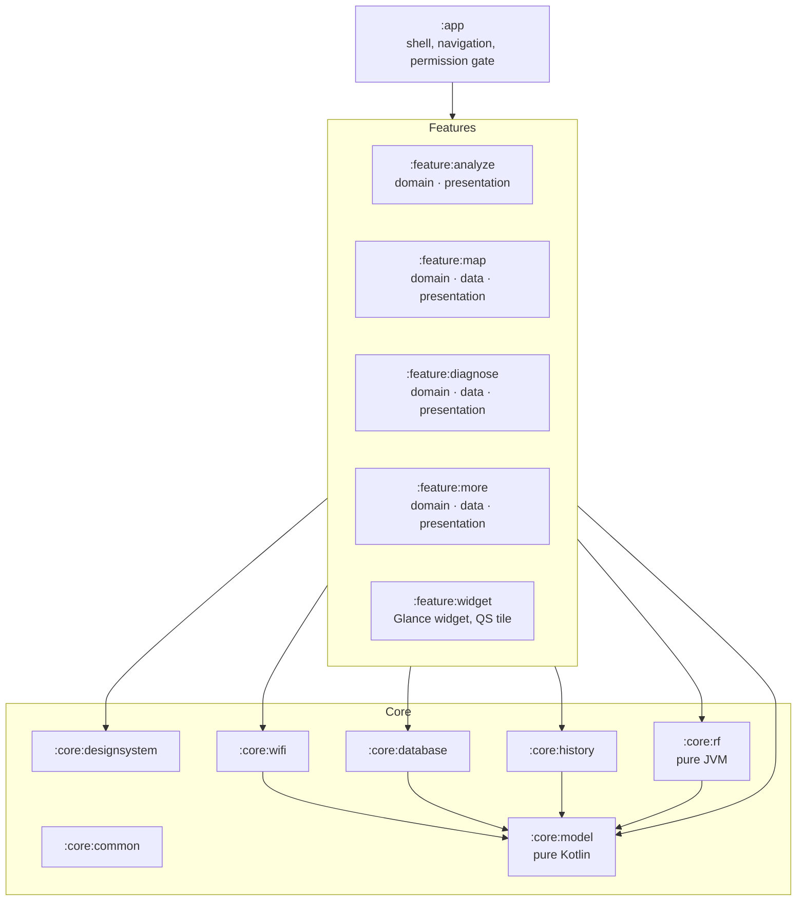
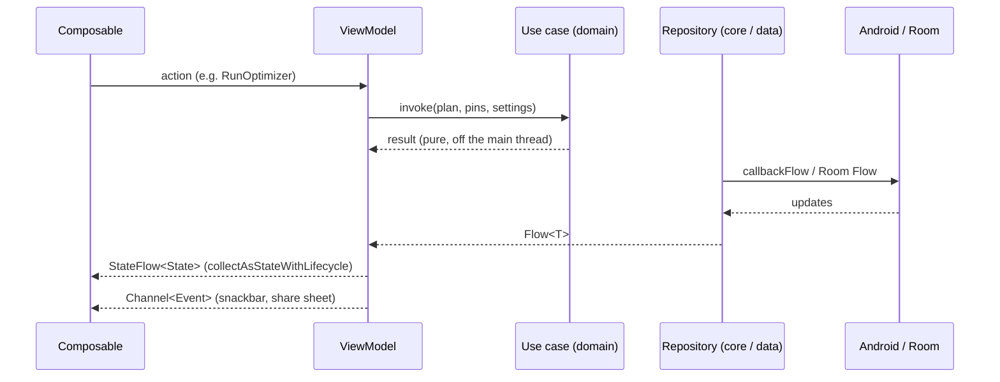

# Architecture

How WifiLens is put together, and why. For the rules you must follow when changing it, see
[DEVELOPMENT.md](../DEVELOPMENT.md); for the reasoning behind each big decision, see the [ADRs](adr/README.md).

## At a glance

- **One app, 20-odd Gradle modules**, layered so that features never depend on each other and the RF maths never
  depends on Android.
- **MVI in every screen:** a ViewModel owns a single immutable `StateFlow<State>`, takes actions, and emits one-shot
  events through a `Channel`.
- **Offline first:** everything is computed and stored on the device. The only network call is the optional speed
  test.
- **Canvas for anything big:** the floor plan, heatmaps, 3D view and charts are drawn with Compose `Canvas`, not with
  one composable per tile.

## Modules



| Layer | Modules | May depend on |
|---|---|---|
| App | `:app` | everything; it wires the graph together |
| Feature presentation | `:feature:*:presentation` | its own `domain`, core modules |
| Feature domain | `:feature:*:domain` | `:core:model`, `:core:rf`, `:core:common` only; plain Kotlin |
| Feature data | `:feature:*:data` | its own `domain`, `:core:database` |
| Core | `:core:*` | lower core modules; never a feature |

A feature gets `domain` and `data` modules only when it has its own logic or storage
([ADR 0001](adr/0001-clean-architecture-layering.md)).
`checkModuleGraph` fails the build on a forbidden module dependency: nothing depends on `:app`, core never depends
on a feature, features never depend on each other, `:core:model` depends on nothing and `:core:rf` only on
`:core:model`. `:core:rf` also uses the plain `kotlin.jvm` plugin, so an Android import there doesn't even compile;
that keeps the RF engine testable in milliseconds.

## A screen, end to end



- **State** is one data class per screen, updated with `_state.update { }`. Composables are stateless and take the
  state plus an `onAction` lambda, which keeps them previewable and testable.
- **Listener-backed Android APIs** (scan results, connectivity, the speed test) are wrapped in `callbackFlow` +
  `awaitClose`, and seeded with the current value on subscribe, because some callbacks never fire when there is
  nothing to report.
- **Process death:** small UI state (active tool, selected room) goes in `SavedStateHandle`. The floor plan lives in
  Room and is autosaved on a debounce, in a single transaction so observers never see half a save (B-01, B-25).

## Wi-Fi layer (`:core:wifi`)

| Flow | Source | Notes |
|---|---|---|
| `wifiScanFlow` | `WifiManager` scan broadcasts | Honours Android's 4-scans-per-2-minutes throttle and shows a countdown. SSIDs decoded from raw bytes on API 33+. |
| `wifiConnectionFlow` | `ConnectivityManager.NetworkCallback` | On API 31+ asks for `FLAG_INCLUDE_LOCATION_INFO`, otherwise Android hides the SSID (B-55). |
| `wifiConnectionPollFlow` | Same, polled | Live RSSI for the signal meter and the walk survey; never triggers a scan. |
| `downloadSpeedFlow` | HTTPS from `speed.cloudflare.com` | Four parallel streams for up to 8 s; the clock starts at the first byte. Tells a blocked network apart from no internet (B-54). |

## Persistence

- **Room v2** (`:core:database`): plans, rooms, pins, survey readings, scan samples, channel congestion and speed
  tests. Schemas are exported to `core/database/schemas/` and every change needs a migration
  ([ADR 0003](adr/0003-room-migrations.md), [ADR 0007](adr/0007-db-v2-multiple-plans.md)).
- **DataStore** for settings: theme and dynamic colour, haptics, auto-scan, and the RF model defaults.
- **History** (`:core:history`) is recorded only while the app is open, and pruned by a WorkManager job.
- The database is excluded from cloud backup, so scan data never leaves the phone.

## RF engine

The floor plan is a `GridPlan`: a grid of roughly 1 m cells, each one of `Floor(roomId)`, `Empty(material)` (a wall)
or `Door`. Because walls are cells, the plan you draw is also the obstacle map, the heatmap and the optimizer's
search space.

```
RSSI(cell) = A − 10 · n · log₁₀(max(d, 1 m)) − Σ wallLoss(material of each wall crossed)
```

- The ray from the router to a cell is traced with **Bresenham's line algorithm**; each wall cell it crosses adds
  its material's loss (drywall, wood, glass, brick, concrete, metal).
- **Calibration:** a walk survey fits `A` and `n` to the measured readings by least squares, and Diagnose reports the
  fit's typical error.
- **Best spot** (`FindBestRouterSpot`) tries every walkable tile, scores it by the *worst* predicted signal across
  the device pins, and picks the maximum. A router already on a tile that ties with the best is reported as optimal
  (B-29). It runs off the main thread and reports progress.

## UI and design system

- **Material 3 Expressive** tokens, shapes and motion live in `:core:designsystem`
  ([ADR 0005](adr/0005-m3-expressive.md)); features use its `WifiLens*` components rather than raw Material ones.
- **Navigation Compose** with type-safe routes, one graph per feature and predictive back
  ([ADR 0004](adr/0004-navigation.md)).
- **Accessibility:** 48 dp targets, content descriptions, TalkBack roles on custom rows, text that fits at 200 %
  font scale.

## Dependency injection

Hilt everywhere, including Hilt workers ([ADR 0006](adr/0006-hilt.md)). Repositories are bound to interfaces in
`:core:model`, so ViewModel tests use fakes and never touch Android.

## Performance

A Baseline Profile ships in the app and macrobenchmarks in `:baselineprofile` measure startup and frame timing.
Release builds use R8 full mode. Compose stability is declared in `compose_stability.conf`, so model classes
don't cause needless recomposition. Numbers are in [project/sprint-log.md](project/sprint-log.md) (Sprint 12).

## Where to look

| To change… | Start in |
|---|---|
| How signal is predicted | `core/rf` |
| A scan, connection or speed-test behaviour | `core/wifi` |
| The floor plan editor or 3D view | `feature/map/presentation` (`MapCanvas`, the 3D renderer) |
| Coverage, Best spot, Speed, Signal | `feature/diagnose` |
| Networks, Spectrum, Health | `feature/analyze` |
| Colours, type, shapes, shared components | `core/designsystem` |
| Database entities and migrations | `core/database` |
